# JavaScript学习笔记

事件对象的常用方法：

```JavaScript
stopPropagation(); // 阻止事件冒泡
stopImmediatePropagation(); // 彻底阻止事件，元素上的其他监听事件都不会被触发

preventDefault();  // 阻止事件的默认动作
```


JavaScript 是单线程的，浏览器实现了异步操作，整个js程序是事件驱动的，每个事件都会绑定相应的回调函数，promise是后来提出的标准。


JavaScript中的void关键字

void操作符指定要计算或者运行一个表达式，但是不返回值

当运行void () 报错，void 后必须跟着表达式

语法格式： `void func()    或者   void(func())`

实例：

```JavaScript
//实例1： 当点击超链接时什么也不发生
<a href="javascript:void(0);></a>

//实例2： 执行void操作符中的代码
<a href="javascript:void(console.log('hello'))"></a>


```


#和javascript:void(0) 的区别：

1. #可以跳转到设置了id的目的地

2. javascript:void(0)则一动不动，我们称之为死链接


JavaScript中的六种错误类型

```JavaScript
1.SyntaxError语法错误
例如变量名不符合规范，给关键字赋值
var 1;
var 1a;
function = 5;

2.Uncaught ReferenceError 引用错误
引用一个不存在的变量时发生的错误
给一个值分配给无法分配的对象会发生错误
console.log('abc') = 21;


3. RangeError 范围错误
例如数组长度为负数，  [].length = -5;

4.TypeError类型错误
例如
123();
var o = {};
o.run();

5.URIError   url错误
主要是相关函数的参数不正确

6.EvalError   eval()函数执行错误
```


关于url编码

URL只能使用英文字母、阿拉伯数字和某些标点符号，不能使用其他文字和符号。

如果URL中有汉字，就必须编码后使用。

1. **网址路径的编码，用的是utf-8编码** 

2. **查询字符串的编码，用的是操作系统的默认编码。** 

3. **GET和POST方法的编码，用的是网页的编码。** 

4. **在Ajax调用中，IE总是采用GB2312编码（操作系统的默认编码），而Firefox总是采用utf-8编码。** 


为了解决编码混乱的问题，所以使用JavaScript对 url编码


escape()不能直接用于URL编码，它的真正作用是返回一个字符的Unicode编码值。

除了ASCII字母、数字、标点符号"@ * _ + - . /"以外，对其他所有字符进行编码。在\u0000到\u00ff之间的符号被转成%xx的形式，其余符号被转成%uxxxx的形式。对应的解码函数是unescape()。


在生产中，使用最多的是encodeURI()  和decodeURI() ,分别对应着编码和解码

```JavaScript
let url =
        "https://www.baidu.com/s?tn=78000241_19_hao_pg&ie=utf-8&wd=中国";

      url = encodeURI(url);
      console.log(url);
      //https://www.baidu.com/s?tn=78000241_19_hao_pg&ie=utf-8&wd=%E4%B8%AD%E5%9B%BD

      url = decodeURI(url);
      console.log(url);
      //https://www.baidu.com/s?tn=78000241_19_hao_pg&ie=utf-8&wd=中国
```


encodeURIComponent()。与encodeURI()的区别是，它用于对URL的组成部分进行个别编码，而不用于对整个URL进行编码。

因此，"; / ? : @ & = + $ , #"，这些在encodeURI()中不被编码的符号，在encodeURIComponent()中统统会被编码。至于具体的编码方法，两者是一样。


let a = decodeURIComponent("%"); 为什么会报错

在这里 % 相当于转义字符，%后面没有内容会报错，把%换成其他标点符号不会报错


## var 垃圾

var没有块级作用域，不是函数作用域就是全局作用域，意味着var可以穿透for和if

var允许重新声明

```JavaScript
var user = 'sss';
var user = 'ssaa';
//不会报错

let user = 'ss';
let user = 'aaa';

//会报错
```


var声明的变量，可以在声明语句前被使用，也就是变量提升

## 什么是变量提升？

在JavaScript中变量可以先使用后声明，

 js有变量提升和函数提升，指的是用 **var声明变量**  或用 **function 函数名（）{  }**  声明的，会在 js预解析 阶段提升到顶端；（es6的let  和 const 不会提升）

其次，**函数提升优先级 高于 变量提升**

**注意，**  相同作用域时声明变量而不赋值则还是以前的值， 而子作用域声明不赋值则函数内该值为undefined，因为声明了私有变量

```JavaScript
x = 5;
console.log(x);
var x; 
//不会报错
```


在严格模式中不允许使用未声明的变量

```JavaScript
var a;
a();
function a() {
console.log(a);
}
//不会报错

等价于
function a(){
  console.log(a);
}

var a;

a();
```


## 怎么判断一个对象是不是数组？

最便捷的方法：

`Array.isArray(arr);`

其他方法：

`typeof(arr)` 返回object,不可用

`instanceof`在跨frame对象构建的场景会失效

`Object.prototype.toString.call(arr) === '[object Array]';`可以使用


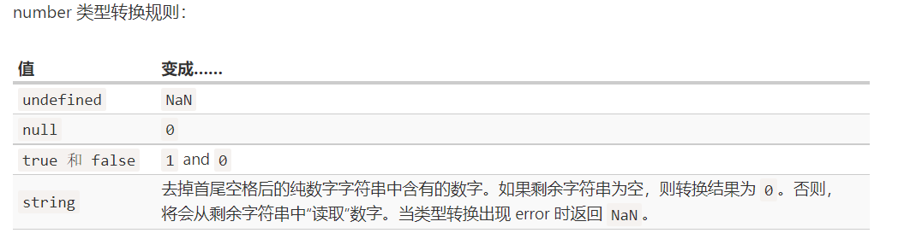

```JavaScript
Number()
Number(0)
Number('')
Number('0')
Number(false)
Number(null)
Number([])
Number([0])
// 以上结果都为0
```


```JavaScript
    console.log(Number(""));           //0
    console.log(Number(null));         //0
    console.log(Number(undefined));    //NaN

    console.log(parseInt(""));        //NaN
    console.log(parseInt(null));      //NaN
    console.log(parseInt(undefined)); //NaN

    console.log(null == 0); //false
    console.log(undefined == 0); //false
```


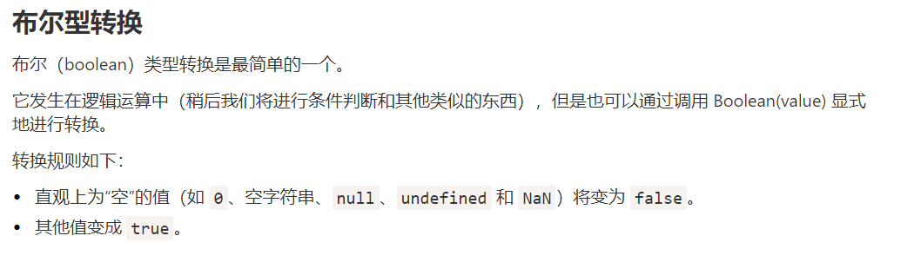


### call 和 apply的区别

call 需要传递明确几个参数，写全

apply可以接受一个数组作为参数，数组长度不限

例如求最大值

```JavaScript
var a = [1,4,5,2];
Math.max.apply(null,a);
```


### typeof运算符可能结果

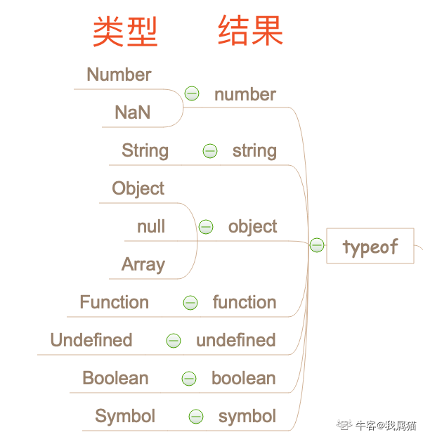


instanceof的特殊情况

`typeof null` 会返回 `"object"` —— 这是 JavaScript 编程语言的一个错误，实际上它并不是一个 `object`


`typeof null = object`

null的类型是object，这是历史原因造成的，null被当作object的一种特殊值。但是null并不是Object的实例化对象，所以

`null instanceof Object = false`


const定义的常量不可以修改，但是const定义的对象，其属性可以修改！！！


### 前端优化—白屏时间和首屏时间

白屏时间指的是浏览器开始显示内容的时间


首屏时间指的是用户打开网站开始，到浏览器首屏内容渲染完成的时间。

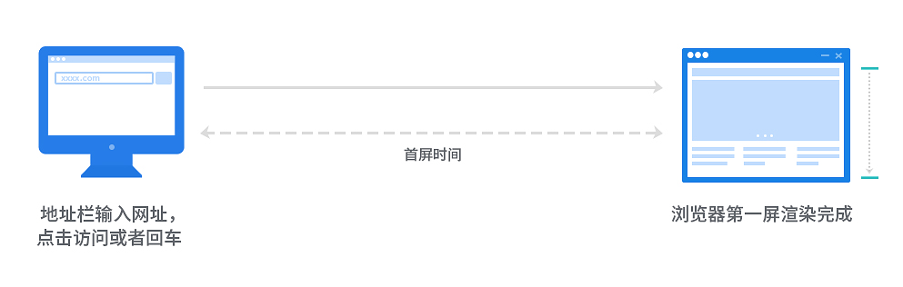

具体说明：

[前端优化-如何计算白屏和首屏时间 - o笨小孩o - 博客园 (cnblogs.com)](https://www.cnblogs.com/longm/p/7382163.html)


JavaScript是一门动态语言


## [前端性能优化 —— reflow(回流)和repaint(重绘)](https://www.cnblogs.com/zhutao/p/6551216.html)

回流和重绘的区别：回流影响到其祖先元素，重绘则自身重新渲染，回流更耗费性能


以下情况会导致reflow:

1.改变窗口大小

2. 改变文字大小

3.内容的改变，如用户在输入框中敲字

4.激活伪类，如：hover

5.操作class属性

6.脚本操作DOM

7.计算offsetWidth和offsetHeight

8.设置style属性 改变颜色会引起重绘


## 运算符优先级

```JavaScript
console.log('value is' + (val!='0') ? 'define' : 'undefine');

//其中val已经定义

答案为  define
加号优先级高于三目运算符，低于括号，所以左边一定是true
```


## 正则表达式

创建正则表达式有两种语法：

1. `regexp = new RegExp('pattern','flags')`

2. `regexp = /pattern/flags;`

常用修饰符：

|i|忽略大小写|
|---|---|
|g|全局搜索，即查找所有的匹配项|
|m|多行模式|
|u|开启unicode支持|
|y|粘滞模式|


常用字符类：

|\d|数字，0-9|
|---|---|
|\s|空格符号，包括\t  \n  \v  \f  \r|
|\w|单字，包括字母、数字、下划线，非拉丁字母不属于\w|
|\D|非数字|
|\S|非空格|
|\W|非单字|
|.|除换行符外的任何字符 [带有“s”标志时点字符类严格匹配任何字符](https://zh.javascript.info/regexp-character-classes#dai-yousbiao-zhi-shi-dian-zi-fu-lei-yan-ge-pi-pei-ren-he-zi-fu)|


重点： unicode修饰符

[Unicode：修饰符 “u” 和 class \p{...} (javascript.info)](https://zh.javascript.info/regexp-unicode)

可以使用 \p{...} 来查找特殊类型的字符


常用正则方法:

```JavaScript
let str = "suntianjing wo ai ni";

let regexp = /jing/
// 1.搜索,返回的是索引，如果没有则返回-1
str.search(regexp);

//2.返回匹配项
str.match(regexp);

//3.测试是否符合表达式
str.test(regexp)

exec() 方法检索字符串中的指定值。返回值是被找到的值。如果没有发现匹配，则返回 null。

```


锚点：  字符串开头：^  字符串结尾 $

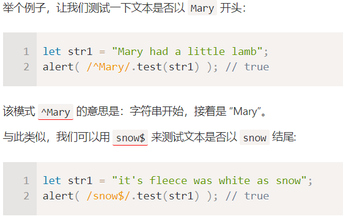


[正则表达式练习（js）_若水弹丸之地-CSDN博客_正则练习](https://blog.csdn.net/b954960630/article/details/82634008)


注意：当一个盒子没有大小时，例如高等于0，是无法触发点击事件的

`<div onclick="alert(1)"></div>`


## this指向问题

在严格模式下：

1. 函数中的this指向：this === undefined

2. 在全局中的this指向： this === window

3. 其他的this指向与非严格模式的this指向一样，只有函数中的this要注意，是undefined


任何对象转成布尔值都为 true,注意

```JavaScript
var x = new Boolean(false);
if(x){
  alert('hello');
}

//输出hello,因为x转化为布尔值是true,x是一个对象
```


[如何判断Javascript对象是否存在 - 阮一峰的网络日志 (ruanyifeng.com)](http://www.ruanyifeng.com/blog/2011/05/how_to_judge_the_existence_of_a_global_object_in_javascript.html)


### 构造函数始终返回一个对象

```JavaScript
function Str(){
  return String('hello')
}  // 返回一个空对象

function Str(){
  return new String('hello')
}  // 返回 String 对象

// 构造函数始终返回一个对象
//如果你写了return {}则返回这个对象
//如果没写return 则返回一个基于原型的对象
//如果return的是一个原始值，则返回一个空对象
```


## Array的concat方法

用于连接数组

```JavaScript
var hege = ["Cecilie", "Lone"];
var stale = ["Emil", "Tobias", "Linus"];
var kai = ["Robin"];
var children = hege.concat(stale,kai);

//用于连接这三个数组
结果为Cecilie,Lone,Emil,Tobias,Linus,Robin
如果想连接两个数组也可以和使用
[].concat(arr1,arr2)
等价于
arr1.concat(arr2)

参数未必是数组，也可以是值，
[].concat(1, 2, 3) =》 [1,2,3]

```


for...in..循环对象，遍历的是对象的属性

for...of...循环数组,数组是一种特殊优化的对象，所以理论上也可以使用for..in,但是性能不行

for...of...同样可以遍历字符串，可以理解为字符串就是一种类数组的对象，其索引与数组极其相似


利用正则表达式解析url

```JavaScript
      //指定参数名称，返回该参数的值 或者 空字符串
      //不指定参数名称，返回全部的参数对象 或者 {}
      //如果存在多个同名参数，则返回数组
      function getUrlParam(sUrl, sKey) {
        let obj = {};

        sUrl.replace(
          /([0-9A-z-%]+)=([0-9A-z-%]+)/g,
          function (item, key, value) {
            if (!obj[key]) {
              obj[key] = value;
            } else {
              obj[key] = [].concat(obj[key], value);
            }
          }
        );

        if (!sKey) {
          return obj;
        } else {
          if (sKey in obj) {
            return obj[sKey];
          }
          return "";
        }
      }

      console.log(
        getUrlParam(
          "http://www.nowcoder.com?key=1&key=2&key=3&test=4#hehe",
          "key"
        )
      );
```


另一种方法;

```JavaScript
function getUrlParam(sUrl, sKey) {
var paramArr = sUrl.split('?')[1].split('#')[0].split('&'); // 取出每个参数的键值对放入数组
const obj = {};
paramArr.forEach(element => {
const [key, value] = element.split('=');  // 取出数组中每一项的键与值
if(obj[key] === void 0){   // 表示第一次遍历这个元素，直接添加到对象上面
obj[key]=value
} else{
obj[key]=[].concat(obj[key],value); // 表示不是第一次遍历说明这个键已有，通过数组存起来。
}});
return sKey===void 0? obj:obj[sKey]||''   // 如果该方法为一个参数，则返回对象。
//如果为两个参数，sKey存在，则返回值或数组，否则返回空字符。
}
```


数组去重

```JavaScript
Array.prototype.uniq = function () {
    return Array.from(new Set(this));
}
```


时间格式化输出

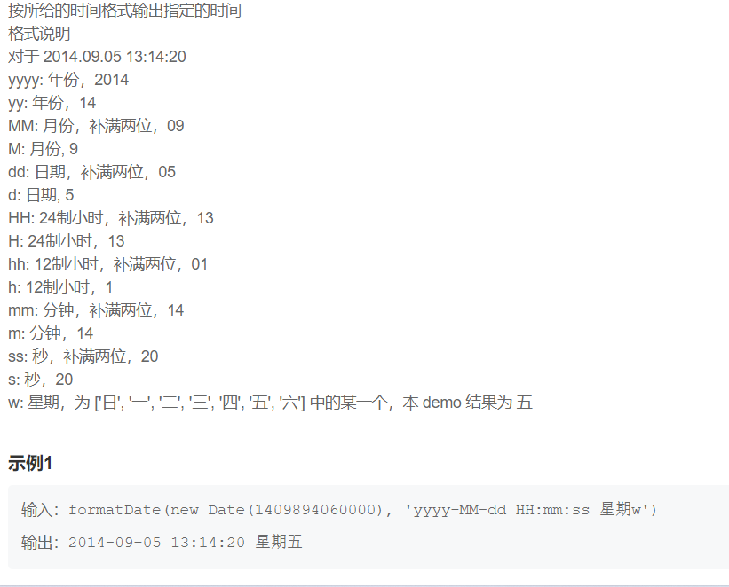

思路：新建一个对象，对象里存放各种格式的数据，例如yyyy和yy都存储，最后在将格式串替换掉即可


str.charCodeAt(index)

获取字符的编码，注意index一般要写，默认为0


邮箱字符串判断：

正则较为复杂，可以网上搜索

```JavaScript
function isAvailableEmail(sEmail) {
    return /^([A-Za-z0-9_\-\.\u4e00-\u9fa5])+\@([A-Za-z0-9_\-\.])+\.([A-Za-z]{2,8})$/.test(sEmail);
}
```


## 字符串、数字之间进制的转换

数字转字符串

num.toString(base)

base为进制，num为10进制


字符串转数字

parseInt(str,[base])

base为进制,str为10进制


## 数组方法的复习

首先，数组是一种经过特殊优化的对象，JavaScript引擎将数据存在连续的内存上使得其的性能更加的强大

下面介绍四种在数组头或者数组尾操作的方法

在数组头操作：

shift() 删除

unshift() 添加

在数组尾操作:

pop()  删除

push()  添加  最常用


数组的长度等于最大索引加1，即便中间没有数据，这和其他语言不同，因为JavaScript的数组是基于对象的，我们可以添加任何属性


在数组尾操作数据性能更佳，为什么？

因为在数组头删除或者添加数据，其他数据都要重新编号


循环数组的方法：

常见的for循环肯定是可以的，通常我们也经常使用这种方法

for...of... 是数组的特有方法，他没有办法获得数组的索引，优点是写法比较简洁

```HTML
for(let a of arr){
  // a是数组元素值
}
```


由于数组是一种特殊的对象，所以我们可以使用for...in循环数组

当时我们不应该这么做，因为数组对象中还有其他的属性，比如length

遍历出来的元素不全是我们想要的，而且for...of...是经过特殊优化的，速度更快


怎么清空一个数组？

最简单的方法就是设置数组的长度为0

arr.length = 0


之前学过，对象是一种引用类型，所以自然不能直接用 == 比较两个数组

那么怎么比较两个数组呢？

可以使用遍历来逐个比较


### splice()和slice()

`arr.splice(start[, deleteCount, elem1, ..., elemN])`

splice()方法相当强大，可以删除亦可以添加

deleteCount为0时，即可添加元素


splice()和slice()的区别之一就是，splice()修改原数组，而slice()返回修改后的新数组

所以我们要得到修改后的数组，需要 设置 arr = arr.slice(a,b);


arr.concat()方法在日常中经常使用，参数可以为数组，也可以是元素，相当自由，这个函数的返回结果是一个新数组，所以我们可以使用这个函数来将多组数据生成一个数组

例如 [].concat(1,2,3,4,5)

### 数组其他的遍历方法

forEach()方法

为每个元素都运行一个函数，该方法几乎可以满足所有需求

用法：

```JavaScript
arr.forEach(function(item,index,array){

})
```


### 在数组中搜索

```JavaScript
indexOf(item,from)  //若没有则返回-1

lastIndexOf(item,from)

includes(item,from)  // 返回布尔值

在字符串对象中也有同样的方法。
```


还有另外一种高级搜索，可以返回搜索到的元素

```JavaScript
let res = arr.find( (item,index,array) => {
  //如果返回true,则返回item，停止迭代
  否则返回 undefined
} )
```


另外一种方法 arr.findIndex() 很少使用，返回的是索引，和indexOf()方法很像


和find()方法相似的方法还有一种，就是 arr.filter()方法

filter方法返回所有满足条件的元素，结果是一个数组

```JavaScript
let res = arr.filter( (item,index,array) => {
  // 返回true 则item 被push到res数组
} )
```


### 转换数组

arr.map()方法，对每个元素执行一个函数，return 的结果被push到结果数组。


以上，我们学习了几种对每个元素执行回调函数的方法

分别是 forEach() , find() , map() ，filter()


### 数组排序

arr.sort() 方法默认按字符串顺序排序，除非定义函数

最简单的排序方法：

```JavaScript
arr.sort((a,b) => a-b)
```


### 字符串拆分

split()方法可以结合join()方法使用


此外，这里介绍一种数组求和方法

```JavaScript
let arr = [12,3,4,5,6]

let res = arr.reduce( (sum,item) => sum + item,0 )
// 自己体会
```


怎么判断一个变量是不是数组？

可以使用 Array.isArray(value)方法

使用typeof arr 是不可行的，别忘了数组也是一种对象


## this指向

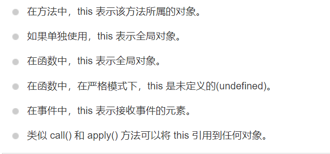

[Javascript 的 this 用法 - 阮一峰的网络日志 (ruanyifeng.com)](https://www.ruanyifeng.com/blog/2010/04/using_this_keyword_in_javascript.html)


## 怎么获得倒数第N个字符？

`str.charAt(str.length - n)`; //获得倒数第n个字符


### parseInt(str,radix)注意事项

举个例子  parseInt('01010101',2);

在这里2是指字符串中数字的基数，注意注意，结果返回的数字是十进制！！！！


## JavaScript数字精度问题

就像我们日常中遇到的 1/3是一个无线循环小数一样，JavaScript在计算机底层用二进制表示，所以类似于0.3就无法准确的表示，而是一个无线循环小数

解决方案：

使用toFixed方法

```JavaScript
let sum = 0.1 + 0.2;
console.log(+sum.toFixed(2))
//该方法返回一个字符串，且保留小数点后两位数字
```


## 怎么知道小数点后面有几位呢？

一种巧妙的方法，将数字转成字符串，再获取小数点的索引值，即可求出

字符串长度 - 小数点索引 - 1


## JavaScript模块化学习—重要

---


## 什么是闭包？怎么使用？—重要

---

理解词法环境

[变量作用域，闭包 (javascript.info)](https://zh.javascript.info/closure#tasks)


使用let 在if代码块里定义变量时，在外部是不能使用的

```JavaScript
let phrase = 'hello';

if(true){
  let user = 'john';
  
  function(){
    console.log(phrase + user;)
  }
}

sayHi();
//报错，因为sayHI是在if块内定义的，这里不能获取  

```


## let 定义的变量具有‘未初始化’状态

```JavaScript
let x = 1;

function func() {
  console.log(x); // ReferenceError: Cannot access 'x' before initialization
  let x = 2;
}

func();
为什么会这样呢，搜先程序进入代码块的那一刻起，变量就进入了‘未初始化状态’，直到使用let我们才可以使用该变量，与var的变量提升有一点
```


## 怎么知道数组中是否含有某个元素？

1. 使用arr.includes(x) 查找，返回布尔值

2. 使用arr.indexOf(x),返回索引值，如果没有则返回-1

3. arr.lastIndexOf(x) 和上面同理

4. 使用arr.find()  arr.findIndex()  arr.filter(),但是过于麻烦，不建议使用


## 了解什么是柯里化

柯里化是一种转换，将f(a,b,c)转换成可以被f(a)(b)(c)的形式调用，JavaScript实现通常都保持该函数可以被正常调用，并且如果参数数量不足，则返回偏函数


最简单的实例：

```JavaScript
      function curry(f) {
        return function (a) {
          return function (b) {
            return f(a, b);
          };
        };
      }

      function sum(a, b) {
        return a + b;
      }

      let curriedSum = curry(sum);
      console.log(curriedSum(1)(2));
```


## 学习原型链

```JavaScript
__proto__  应用于对象
F.prototype 应用于构造函数，并且当构造函数被实例化时，为实例的[[prototype]]赋值
```


默认情况下，所有函数都有 `F.prototype = {constructor：F}`，所以我们可以通过访问它的 `"constructor"` 属性来获取一个对象的构造器。

所有的delete操作都直接应用于对象，不会顺着原型链往上搜索


我们可以在以后会使用原型借用，什么是原型借用呢？就是一个对象的方法去借用于另外一种对象的原型方法

我们可以使用 `Object.create` 来实现比复制 `for..in` 循环中的属性更强大的对象克隆方式：

```JavaScript
let clone = Object.create(Object.getPrototypeOf(obj), Object.getOwnPropertyDescriptors(obj));
```


*   [Object.create(proto, [descriptors])](https://developer.mozilla.org/zh/docs/Web/JavaScript/Reference/Global_Objects/Object/create) —— 利用给定的 `proto` 作为 `[[Prototype]]`（可以是 `null`）和可选的属性描述来创建一个空对象。
*   [Object.getPrototypeOf(obj)](https://developer.mozilla.org/zh/docs/Web/JavaScript/Reference/Global_Objects/Object/getPrototypeOf) —— 返回对象 `obj` 的 `[[Prototype]]`（与 `__proto__` 的 getter 相同）。
*   [Object.setPrototypeOf(obj, proto)](https://developer.mozilla.org/zh/docs/Web/JavaScript/Reference/Global_Objects/Object/setPrototypeOf) —— 将对象 `obj` 的 `[[Prototype]]` 设置为 `proto`（与 `__proto__` 的 setter 相同）。


## Eval()函数

可以执行一个代码字符串

例如

```JavaScript
let code = 'alert("Hello")';
eval(code); // Hello
```


在现代JavaScript编程中，我我们很少使用eval(code) 函数


## 个人对模块化的理解

一个模块应该只专注于做一件事情，减少对插件的依赖


## 自己写一个全屏滚动插件

[用 ES6 写全屏滚动插件 - 掘金 (juejin.cn)](https://juejin.cn/post/6844903602574770183#heading-0)

设计到防抖函数、节流以及懒加载，重点掌握


批量改变对象的属性，可以想到改变对象的原型


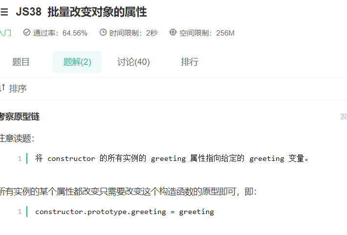


怎么去获取不在原型链上的属性？

我们可以使用对象原型方法来解决这个问题

```JavaScript
Object.getOwnPropertyNames(obj)
返回对象所有自己的属性，包括可枚举和不可举

Object.keys(obj)
返回所有可枚举的属性
```


函数中声明变量要么使用var要么使用let，否则就是一个全部变量

闭包就是能够读取其他函数内部变量的函数

在本质上，闭包就是将函数内部和函数外部连接起来的桥梁


函数名.length可以获取函数形参的个数


## 学习位运算

&  |   ~   ^  

什么是异或呢，就是当不同的时候返回1，相同的时候返回0

左移 <<     二进制数字向左移动，右边填充0

右移 >>     二进制数字向右移动，左边最高位如果是1则左边填充1，如果为0则左边填充0

无符号右移  >>>   左边填充0

位逻辑运算符最多只能对32位整数进行运算，如果超过32位则取后面32位

9<<2产生36，因为1001移位2比特向左变为100100，它是36。


逗号运算符,

```JavaScript
let a = (1+2,3+4);  //a = 7


```


通过new String()创建的是一个对象，

String()创建的是string类型，是原始值

```JavaScript
let str = new String('hello')
typeof str // object

let str = String('hello')
typeof str // string
```


使用new调用函数一定会返回一个对象，可以理解为构造函数（就是）,构造函数是一定会返回一个对象的，返回的对象有以下几种情况

没有return  的时候，返回一个基于huaman.prototype的对象，并且设置了定义的属性


有return 的时候,如果return 的是一个对象，则就是这个对象，如果return 的不是一个对象，则return 一个空对象


map和对象的区别，对象的键只能是字符串，map的键可以是任何值

set是一种特殊的类型的集合，每个值只能出现一次

所以可以利用set来给数组去重

```JavaScript
let arr = [1,2,2,3,3,4,5,6,6]
arr = Array.from(new Set(arr));
```


## number.toFixed(x)和number.toPrecision(x)的区别

toFixed()可以让小数点后有x位

toprecision分俩中情况，当number位小数时，输出结果为小数点后有x位，如果为整数，则这个数字有x位


## 学习迭代器

[Generator (javascript.info)](https://zh.javascript.info/generators)

我们要使用一种特殊的语法结构:

function*

运行这样的函数后，我们会得到一个可迭代对象Generator,

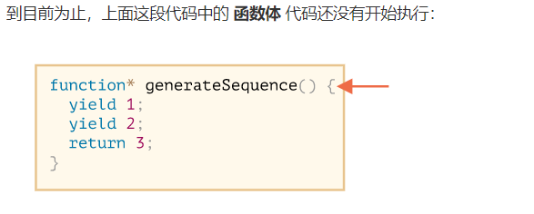

使用next()可以往下执行


可以这样遍历迭代器

```JavaScript
function* func() {
        yield 1;
        yield 2;
        yield 3;
      }

      let generator = func();

      console.log(...generator);
```


也可以使用for...of...遍历迭代器

```JavaScript
function* func() {
        yield 1;
        yield 2;
        yield 3;
      }

      let generator = func();

      for (let value of generator) {
        console.log(value);
      }
```


## 复习基础运算符


在这里再次说明，delete obj.x  这里只删除了x属性的值，并没有完全删除这个属性， 即  obj.x === undefined


setTimeout()函数不是一个全局函数，而是window对象的一个方法，注意，window并不意味着就是全局变量（疑惑）


当两种类型的值比较的时候，会把两边都转化成number类型，再进行比较，一定要记住这个！！！(错误❌)只有类型不同的时候才会发生转换

所以 '2`  >  '12  是成立的，因为类型一样，不会发生类型转换

严格相等比较符，不会做任何的转换，要记住！！

null  ==  0  不成立

但是  null  大于等于  0是成立的  

undefined只和null相等，和其他任何值比较都返回false


NaN不等于NaN，它就是一种错误的值，和任何值都不相等，除了null


附加:有两种比较

关系运算符

对于null和undefined直接转化成数字，即0和NaN


相等运算符

在对null和undefined做相等比较的时候，会把null和undefined转化成false

所以有 null == undefined  true

  null == 0   flase


## null、undefined和其他值做相等比较时，不会做类型转化，undefined是null的衍生，所以null == undefined


`math.round的原理为加0.5再向下取整`


parseint(1a)  ===  1


严格模式下，函数的this是undefined,非严格模式下,this == window


在js和css中，分别显示背景颜色

js中用驼峰命名，css中用横杠表示

```CSS
//js
backgroundColor

//css
background-color
```


document.write()会产生重绘，在一个已经加载了的页面上，执行document.write(),相当于再打开一个页面


NaN + 2 和 NaN + '2' 的区别

NaN不能和数字相加，和字符串相加是就是字符串拼接


## RegExp对象有三个方法

test(): 检测一个字符串是否匹配某个正则表达式，匹配则返回true，否则返回false

exec():  检索字符串中与正则表达式匹配的值，返回一个数组，存放匹配的值，如果没有则返回 null

compile(): 可以再脚本执行过程中编译正则表达式，也可以改变已有表达式

注意： match不是RegExp的方法，而是支持正则表达式的string对象的方法


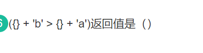

在这里，{}会被转成字符串，也就是[object Object],接下来就是两边字符串的比较了


## 了解一下什么是可迭代对象


相同作用域声明但是不赋值，则还是以前的值

```JavaScript
var a = 1;
var a;

a  == 1
在这里a还是 1

使用let 定义a时，自然是报错的
```


## 关于XML

XML不是HTML 的替代

XML和HTML为不同的目的而设计

XML被设计用来显示数据，其焦点是数据的外观

HTML旨在显示信息，而XML旨在传输信息

简单来说，就是XML就是为了传输数据的，不是为了 取代HTMl


let arr =  [,1,,2,,3]

等于 [undefinde,1,undefined,2,undefined,3]

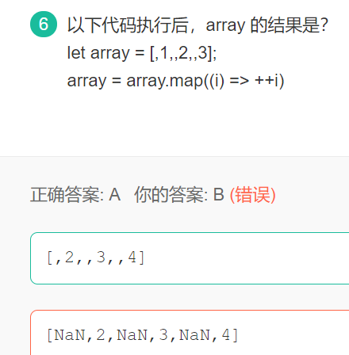


map遍历数组时，不会去空的值，但是在生成的数组中还是会保留这个空值


### array不是保留字，Array才是


IE中的attachEvent中的this总是指向全局对象Window


## 对象没有prototype属性，只有函数才有prototype属性


哪些事件不支持冒泡？

可以使用这个方便记忆

不支持冒泡：妈（mouseenter）妈(mouseleave)不(blur)放(focus)心你(load,unload,resize)


## parseInt(string,radix)可以解析字符串，如果不是字符串就把他转成字符串


## JavaScript实现继承的方式，共六种

1. 原型链继承

2. 借用构造函数继承

3. 组合继承

4. 原型式继承

5. 寄生式继承

6. 寄生组合式继承

[JavaScript实现继承的6种方式 - Leophen - 博客园 (cnblogs.com)](https://www.cnblogs.com/Leophen/p/11401734.html)


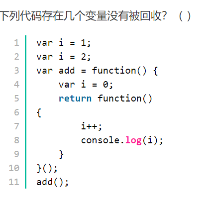

有三个变量没有被回收

1. 全局变量i不会被回收

2. 全局变量add不会被回收

3. 闭包引用的局部变量i不会被回收


## 声明函数只有两种方法

第一种：(函数声明)

function foo(){}

第二种：(函数表达式)

var foo = function(){}

类似于var foo  = function bar(){} 这样的写法是错误的，但是不会报错


执行typeof g()  ,会去执行g函数，但是没有这个函数,所以会报错

注意,执行不存在的函数会报错！！

typeof g  返回的是undefined


## 到底有多少跨域的方法？(六种)


## Array.sort()深入剖析

不知道哇


## 浏览器事件

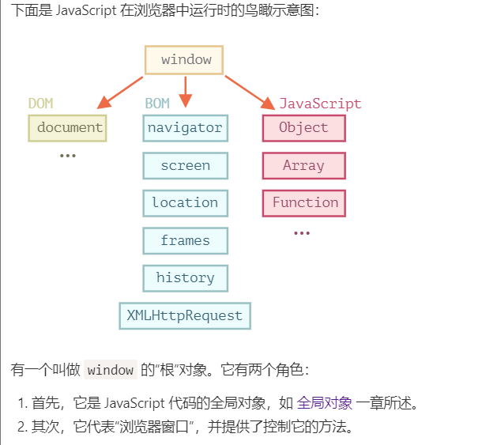


document对象是页面的主要入口点

所以我们可以使用 document.body.style.background = 'red'


## 浏览器BOM入门

### window的属性方法

```JavaScript
window.open()  // 弹窗,其实就是打开新的窗口
window.close()  // 关闭浏览器，关闭当前窗口
innerWidth innerHeight 
浏览器标签页的宽度和高度，包含滚动条

outerWidth  outerHeight
整个浏览器的宽度和高度

screenLeft  screenTop
screenX    screenY
浏览器窗口距离屏幕左上角的距离
```


### location的属性和方法

```JavaScript
location.reload()  // 重新加载
location.href = 'url' //跳转url，可以获取网址信息
location.assign('url') // 跳转,不能获取网址信息
location.replace('url') //替换当前页面，没有历史记录

location.hash //获取锚点名
location.search  //获取搜索的key
location.hostname // 域名
location.port   //端口
location.pathname  //路径名
location.protoclo   //网页协议


```


### history方法

```JavaScript
history.length // 历史记录的数量

history.go(n)   n大于0则向前跳转，小于0则向后跳转

history.back() //  等于  history.go(-1)
history.forward() // 等于 history.go(1)

history.pushState() //向浏览器添加一个状态
有三个参数,一个状态对象，一个标题，一个可选的url

history.replaceState()  和上面的差不多
当时他是修改记录不是添加


```


### screen属性

```JavaScript
screen.availWidth // 电脑屏幕的可用宽度
screen.availHeight  //电脑屏幕的可用高度
screen.width    // 宽度
screen.height  //  高度


```


### navigator属性

```JavaScript
navigator.userAgent  // 浏览器信息
navigator.appName   //浏览器名称
navigator.appVersion // 浏览器的平台和版本
navigator.platform   //运行系统的版本
```


### 浏览器会自动修正标签

<p>hello

会变成  <p>hello</p>


### 在最顶层： documentElement和body

<html> = document.documentElement

<body> = document.body

<head> = document.head


节点包括元素节点和文本节点

### 怎么获取子节点

获取子节点的集合（不是数组）

childNodes

获取第一个子节点

firstChild

获取最后一个子节点

lastChild

### 怎么获取父节点和兄弟节点

父节点

parentNode

下一个兄弟节点

nextSibling

上一个兄弟节点

previousSibling


以上的方法我们获取的是所有的节点，包括元素节点和文本几点，大多数时候我们只想要元素节点

则有以下

```JavaScript
parentNode --> parentElement
childNodes --> children
firstChild --> firstElementChild
lastChild --> lastElementChild
previousSibling -->  previousElementSibling
nextSibling --> nextElementSilbling
```


### 检查一个元素是否符合给定的css选择器，返回true或false

```JavaScript
ele.matches(css)
```


### 找到元素的父级

```JavaScript
ele.closest(css)
查找与css选择器匹配的最近的祖先，自己也会被搜搜
```


### 实时的集合

getElementsBy()都会返回一个实时的集合，querySelectorAll返回的是一个静态的集合

HTML是大小写不敏感的，并且他的值都是字符串。

属性和特性是同步的，


#### 每个DOM节点都有对应的内建类

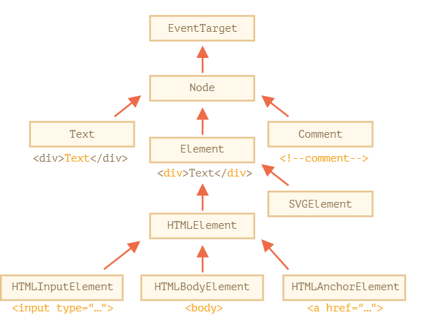


### 获取节点类型

有以下三种（元素节点、文本节点、注释节点）

```JavaScript
对于元素节点 ele.nodeType == 1
对于文本节点 ele.nodeType == 3
对于document对象 ele.nodeType == 9
```


### 获取节点名或者标签名

nodeName

tagName 只限元素节点，最常用

注意标签名称始终是大写的，例如 p  对应的就是 P


### innerHTML只对元素节点有效

如果我们想要获取文本节点的值呢？

我们可以使用 nodeValue 或者data


### 获取元素内的纯文本或着让文字以纯文本显示

textContent可以满足我们的需求

```HTML
<div id = "news">
  <h1>hello world</h1>
  <p>suntianjing</p>
</div> 

news.textContent   -->  hello world 
                        suntianjing
```


或者说我们可以修改元素的纯文本，有什么用呢？

例如，我们想在标签内显示html代码，使用innerHTML会导致标签被解析，使用textContent就不会被解析


## 特性和属性

HTML中的是特性，JavaScript中的是属性

在解析DOM的时候，浏览器会把标准的特性解析成属性，但是非标准的不会被解析

操作特性的方法:

```HTML
ele.hasAttribute(name)  检查这个特性是否存在
ele.getAttribute(name)  获取这个特性
ele.setAttribute(name)  设置这个特性
ele.removeAttritube(name)  删除这个特性
```


特性的值是字符串型的，属性的值不一定是字符串型的，可能是布尔型，也可能是对象

```HTML
<input id="input" type="checkbox" checked> checkbox

<script>
  alert(input.getAttribute('checked')); // 特性值是：空字符串
  alert(input.checked); // 属性值是：true
</script>
```


## 非标准的特性dataset

```HTML
<!-- 标记这个 div 以在这显示 "name" -->
<div show-info="name"></div>
<!-- 标记这个 div 以在这显示 "age" -->
<div show-info="age"></div>

<script>
  // 这段代码找到带有标记的元素，并显示需要的内容
  let user = {
    name: "Pete",
    age: 25
  };

  for(let div of document.querySelectorAll('[show-info]')) {
    // 在字段中插入相应的信息
    let field = div.getAttribute('show-info');
    div.innerHTML = user[field]; // 首先 "name" 变为 Pete，然后 "age" 变为 25
  }
</script>
```


存在一种data-*特性，以data-开头的特性都被提供给程序员保留使用

例如

```HTML
<div id="test" data-about="suntianjing"></div>

    <script>
      console.log(test.dataset.about);
    </script>
```


这样我们就可以直接访问非标准特性的值了，替代了ele.getAttribute(name)


## 修改文档

首先创建一个元素

1. 创建元素节点  document.createElement(tag)

2. 创建文本节点  document.createTextNode(text)

怎么创建一条消息？

```JavaScript
let div = document.craeteElement('div');

div.className = 'alert'

div.innerHTMl = 'hello world'
```


接下来插入元素

下面的方法我们可以插入元素节点，也可以插入文本节点

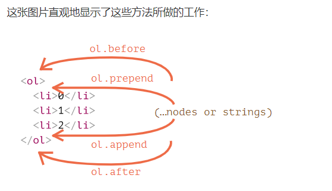

我们使用以上的方法时，我们参数是我们创建的元素节点，自然插入的就是元素节点，如果参数是字符串，那么插入的就是字符串

类似于elem.textContent


如果我们就是想要插入元素呢

可以使用

elem.insertAdjacentHTML(where, html)

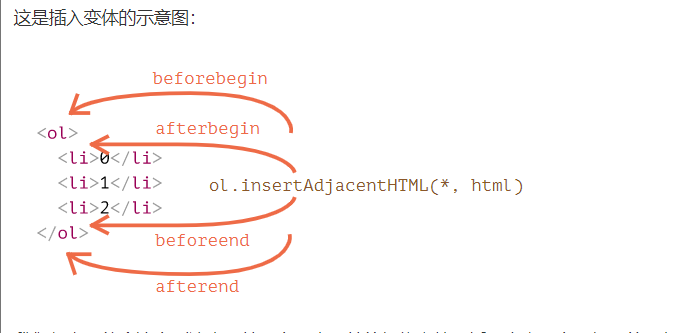


## 移除节点

node.remove()


## 克隆节点

cloneNode(true) 深克隆

cloneNode(false)  浅克隆


## 读取样式

getComputedStyle()

通过style属性去获取，我们只能得到特性值的内容，也就是html标签上的内容，如果我们想要获取css类的内容呢

我们可以使用计算样式

```JavaScript
getComputedStyle(element, [pseudo])

element
需要被读取样式值的元素。
pseudo
伪元素（如果需要），例如 ::before。空字符串或无参数则意味着元素本身。

```


## 元素大小


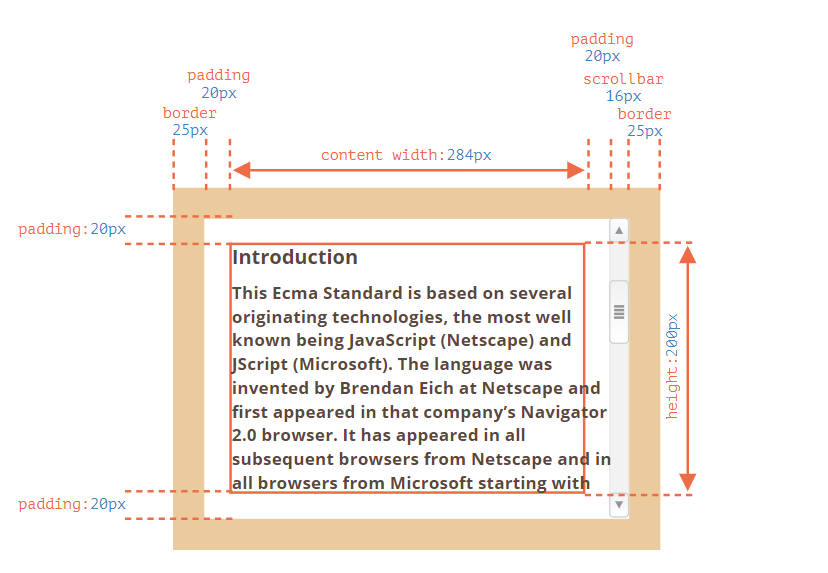

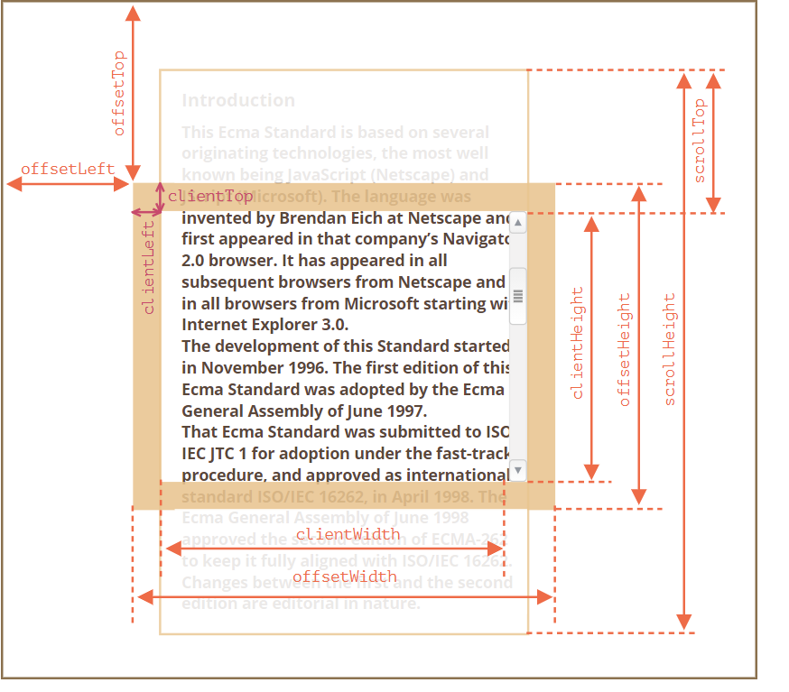


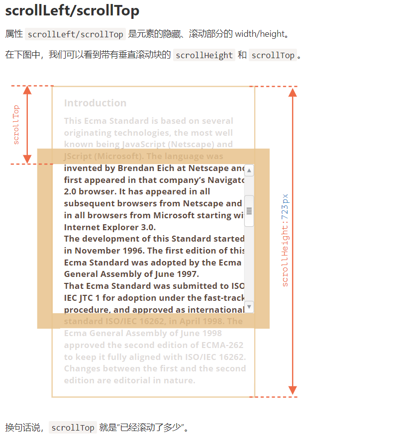


## 获取浏览器的宽度和高度

```JavaScript
document.body.clientWidth
document.body.clientHeight
```


## 怎么获得当前滚动

在之前我们学过scrollLeft或者scrollTop可以获取滚动

事实上我们也可以使用，但是为了兼容性，还有以下方法:

```JavaScript
window.pageYOffset
window.pageXOffset
```


## 滚动页面另外的方法

我们自然可以使用scrollLeft或者scrollTop来滚动页面

还有另外的方法

相对滚动：

scrollBy(x,y)

绝对滚动

scrollTo(x,y)


此外还有一种方法

让元素可见

elem.scrollIntoView(true)

true时，元素在窗口顶部，flase时候，在窗口底部


## 禁止滚动

设置overflow = hidden即可


## 获得坐标

有相对坐标和绝对坐标两种

pageX/pageY 绝对坐标

clientX/clientY 相对坐标

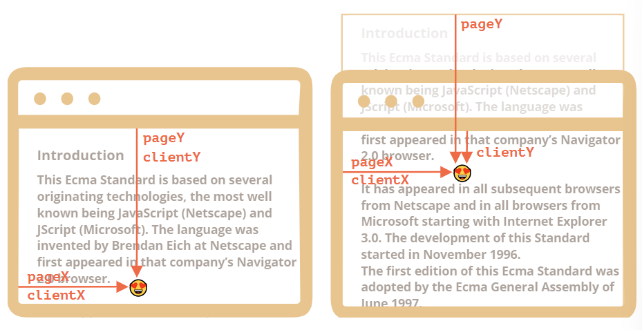

方法ele.getBoundingClientRect()返回最小矩形的窗口坐标

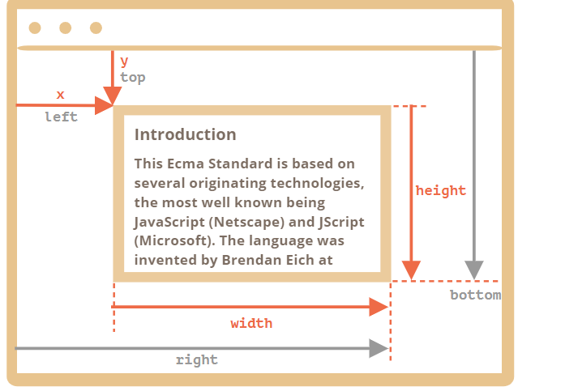


## 移除一个事件

要移除一个事件，必须移除这个事件对应 的函数

```JavaScript
function handler(){
  console.log(1);
}

button.addEventListener('click',handler)
button.removeEventListener('click',handler)


```


## 事件的冒泡和捕获

`addEventListener(..., true)` 的处理程序（`true` 是 `{capture: true}` 的一个简写形式）。


## 阻止浏览器默认事件

使用event.preventDefault()方法

使用return flase, 但是return flase 只能用于 on监听的方法


## 防抖装饰器和节流装饰器

防抖函数:

```JavaScript
function debounce(func,ms){
  let timeout;
  return function(){
    clearTimeout(timeout);
    timeout = setTimeout(() => func.apply(this,arguments),ms)
  }
}
```


就是那么简单


节流函数

```JavaScript
function throttle(func, ms) {

  let isThrottled = false,
    savedArgs,
    savedThis;

  function wrapper() {

    if (isThrottled) { // (2)
      savedArgs = arguments;
      savedThis = this;
      return;
    }

    func.apply(this, arguments); // (1)

    isThrottled = true;

    setTimeout(function() {
      isThrottled = false; // (3)
      if (savedArgs) {
        wrapper.apply(savedThis, savedArgs);
        savedArgs = savedThis = null;
      }
    }, ms);
  }

  return wrapper;
}
```


## 复选框

```JavaScript
    <select name="" id="select">
      <option value="1">saal</option>
      <option value="2">12</option>
      <option value="3">3al</option>
      <option value="4">4al</option>
    </select>
    <button>click it</button>

    <script>
      let btn = document.querySelector("button");
      let select = document.querySelector("select");

      btn.onclick = function () {
        console.log(select.value);
      };
    </script>

   
 //通过获取select的value值来得到选择的值 
```


## 对象的原始值转换

现在我只学习了toString()方法

除了null和undefined外，其他的类型都有toString()方法。

每一个对象都有一个toString()方法

默认情况下，toString()方法被每个对象继承。如果发方法未被覆盖，则返回 [object type], type是对象的类型

为了避免toString()方法被覆盖的问题，我们可以调用

Object.prototype.toString.apply(o)显式调用object.toString()

```JavaScript
    let arr = [1, 2, 3, 4, 6];
      let bool = new Boolean();
      let obj = {};
      let str = new String("suntianjing");
      let re = new RegExp(/sun/);

      console.log(arr.toString()); //1,2,3,4,6
      console.log(bool.toString()); //flase
      console.log(obj.toString()); // [object Object]
      console.log(str.toString()); // suntianjing
      console.log(re.toString()); // /sun/

      console.log(Object.prototype.toString.call(arr)); //[object Array]
      console.log(Object.prototype.toString.call(bool)); //[object Boolean]
      console.log(Object.prototype.toString.call(obj)); //[object Object]
      console.log(Object.prototype.toString.call(str)); //[object String]
      console.log(Object.prototype.toString.call(re)); //[object RegExp]
```


## 正则表达式的断言


## 作用域链？


```JavaScript
[1,2,3].splice(1,1,1) == [2]
是成立的
```


JavaScript有变量提升，这种提升可以穿透if或者for，上面的代码等价于

```JavaScript
var a;
if(! 'a' in window){
  a = 1;
}

alert(a);

使用var定义的要么是全局变量要么是函数局部变量，在这里a自然是全局变量，所以if块不执行
答案是 undefined
```


## 原型链复习

Ø **Object.prototype只是一个普通对象，它是** js****原型链的最顶端

** Object.prototype.proto** === null;//true

** Object.prototype.prototype === undefied;//true** 

**Object.prototype只是一个普通对象** (**普通对象没有** prototype**属性，所以值是** undefined)**，Object.prototype** 是js**原型链的最顶端，它的proto是** null(**有proto属性，但值是** null****，因为这是原型链的最顶端****)****。

Ø **在js** 中如果**A** 对象是由**B** 函数构造的，那么**A.proto**  === B.prototype。

**javascript中对象是由** Object**创建的，函数是由** Function****创建的。

Ø **内置的Object** 是其实也是一个函数对象，它是由**Function** 创建的。

**Object.proto**  === Function.prototype;

Ø **js中每一个对象或函数都有proto属性，但是只有函数对象才有** prototype****属性。

**//****函数对象** 

**function Person()** 

**{** 

**}** 

**//**  **普通对象** 

**var obj = {};** 

**obj.proto**  === Object.prototype;//true

**obj.prototype === undefined;//true** 

**Person.proto**  === Function.prototype;//true

**Person.prototype !== undefined;//true** 

**原型链是基于** ****proto形成的，继承是通过** prototype****实现的。**

Ø **Function.prototype是个特例，它是函数对象，但是没有** prototype**属性。其他所有函数都有** prototype****属性。

**Function.prototype.prototype === undefined;//true** 

Ø **内置的Function** 也是一个函数对象，它是通过自己来创建自己的。

**Function.proto** === Function.prototype;//true

Ø **函数也是对象，因为Function.prototype__proto__指向** Object.prototype。

**typeof Function.prototype.proto** ) === "object";//true

**Function.prototype.proto** === Object.prototype;//true


我们可以这样理解,__proto__类似于一个指针，指向xx.prototype


## 可迭代对象

可以应用for...of...方法的对象被称为可迭代对象，可迭代对象必须实现迭代器

有索引属性和length的叫做类数组对象，string既是可迭代对象又是类数组对象

类数组对象不一定可以迭代，可迭代对象不一定是类数组对象

## Array.from可以应用于可迭代对象和类数组对象

返回一个数组


## flash通过什么和js交互

ExternalInterface类


## 注意数组方法splice的返回值

我们都知道，它会修改原数组，但是他的返回值是被删除的项目，注意

```JavaScript
[1,2,3].splice(1,1,1)
数组从[1,2,3]变成[1,1,3]

但是他的返回值是[2]
```


## 学习类


## 原型链需要再次复习

2021/09/11 21:07:26

对象有一个特殊的隐藏属性[[Prototype]],他要么为null,要么为另一个对象的引用,注意，他是隐藏的！！！

属性[[Prototype]]是内部的而且隐藏的

只能有一个[[Prototype]]，一个对象不能从其他两个对象获得继承

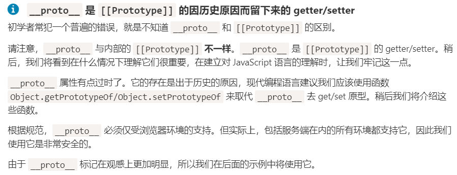

修改一个对象，不会影响到其原型的状态.

方法是共享的，但是对象状态不是


注意了，for..in...会遍历出继承的属性

```JavaScript
      let animal = {
        eats: true,
      };

      let dog = {
        jumps: false,
        __proto__: animal,
      };

      console.log(Object.keys(dog)); // jump

      for (let prop in dog) {
        console.log(prop);
      } // jump、 eats
```


怎么判断一个属性是不是自己的呢（非继承属性）,我们可以使用一个方法

obj.hasOwnProperty(key)

```JavaScript
      let animal = {
        eats: true,
      };

      let dog = {
        jumps: false,
        __proto__: animal,
      };

      console.log(dog.hasOwnProperty("eats"));
```


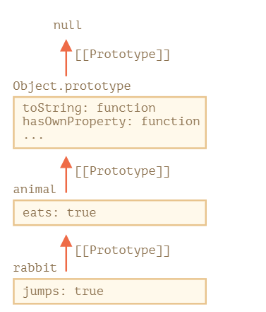

for..in...只会遍历出可枚举的属性和方法,

这就解释了为什么我们没有遍历出Object.prototype中的方法

---

---

对象使用的是__proto__,方法使用的是prototype

如果F.prototype是一个对象，那么new 操作符会使用他作为新对象的[[prototype]]


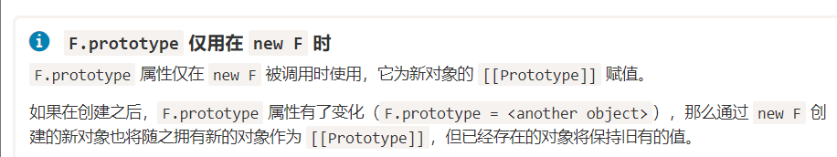

每一个函数都有prototype属性

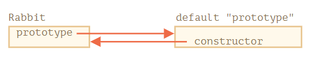


## 原生的原型

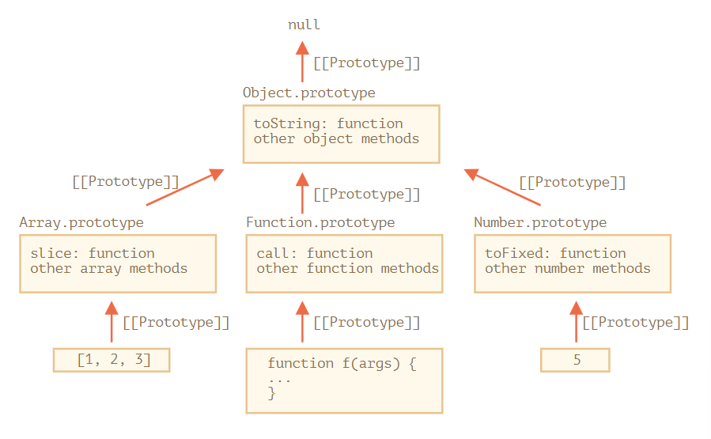

[原型方法，没有 ](https://zh.javascript.info/prototype-methods)[proto](https://zh.javascript.info/prototype-methods)[ 的对象 (javascript.info)](https://zh.javascript.info/prototype-methods)


## 使用setTimeout会导致this丢失

```JavaScript
      let user = {
        name: "hello",
        sayHi() {
          console.log(this.name);
        },
      };

      setTimeout(user.sayHi, 1000);

     并不会运行
     在这里setTimeout接受的是一个函数,等价于
     setTimeout(()=>{
        let f = user.sayHi;
        f()
     },1000) 

    在这里this指向window
    
    解决方案
    1. 
    setTimeout(()=> {
      user.say()
    },1000) 

   2.
   let func = user.sayHi.bind(user)
   setTimeout(func,1000) 
```


## 类的学习


类的方法之间没有括号

```JavaScript
class User {
  constructor(name) { this.name = name; }
  sayHi() { alert(this.name); }
}

// 佐证：User 是一个函数
alert(typeof User); // function
```


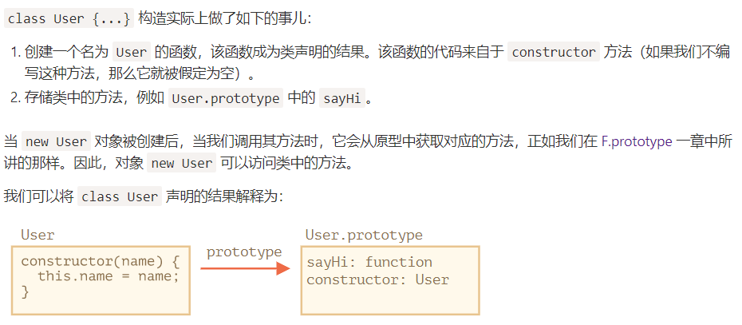


```JavaScript
class User{
  constructor(name){
    this.name = name;
  }
  
  sayHi(){
    console.log(this.name)
  }
}

等价于
function User(name){
  this.name = name;
}

User.prototype.sayHi = function(){
  console.log(this.name)
}
```


所以我们可以将class视为一种定义构造器及其原型方法的语法糖

但是他和普通函数有以下区别

1. class必须经过new来调用，否则会报错

2. 类方法不可枚举

3. 类总是使用use strict


 

### 类表达式

```JavaScript
let user = class{
  sayHi(){
    console.log('hello world')
  }
}
```


类也可以有名字，但是只是在内部可用

let user = class Mycalss{

&ensp;&ensp;&ensp;&ensp;sayHi(){

&ensp;&ensp;&ensp;&ensp;&ensp;&ensp;&ensp;&ensp;console.log(Mycalss)

&ensp;&ensp;&ensp;&ensp;}

}

```JavaScript
我们还可以按需创建类
function makeClass(phrase){
  return class{
    sayHi(){
      console.log(phrase)
    }
  }
}

let User = makeClass('suntianjing')

new User().sayHi() // suntinajing
```


### class字段


之前我们通过constructor初始化的类，他的属性都在prototype中

```JavaScript
class User{
  name = 'suntianjign'
}

let user = new User();
console.log(user.name)
console.log(user.prototype.name) // undefined
```


使用constructor和class字段创建变量的区别是什么捏？

使用constructor创建的变量，设置在prototype中，使用class字段创建的设置在生成的对象中，实际上都存储在当前对象，现在俺也不知道有什么用

类的方法存储在prototype中


### 类继承

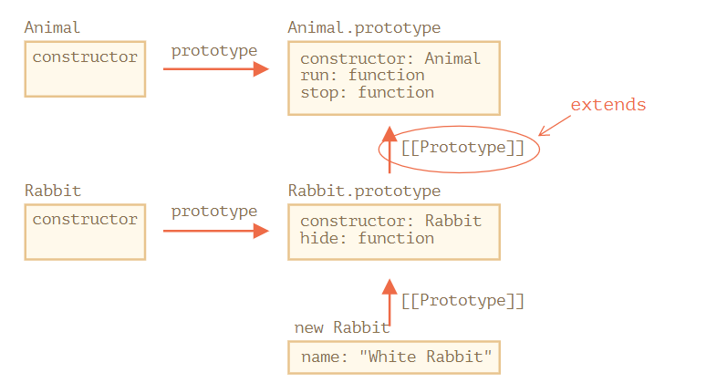

下面是一个完整的例子

```JavaScript
        class Animal {
        constructor(name) {
          this.speed = 0;
          this.name = name;
        }
        run(speed) {
          this.speed = speed;
          console.log(`${this.name} run with speed ${this.speed}`);
        }
        stop() {
          this.speed = 0;
          console.log(`${this.name} stands stop`);
        }
      }

      class Rabbit extends Animal {
        hide() {
          console.log(`${this.name} hides`);
        }
      }

      let rabbit = new Rabbit("hee");
      rabbit.run(5);
      rabbit.hide();
```


### 重写方法


再次重新定义方法就可以实现重写

如果我们想要在重写的方法中再次调用父类函数呢，我们可以使用super.method()来调用一个父类方法

执行super()来调用父类constructor


类的学习先告一段落


```JavaScript
    function func() {
        a = 1;
      }
      func();

      console.log(a);  // 1

     如果在函数中没有使用let 或者var定义了一个变量，则该变量是一个全局变量
     
      
```


```JavaScript
      let arr = [1, 2, 3, 4];

      delete arr[0];

      console.log(arr[0]);
```


使用delete删除对象的值后，他的属性还在的，所以再次访问的时候会返回 undefinded,所以实际上我们一般不会用delete来删除数组元素,一般使用shit()   pop()  splice()


## JavaScript模块化


[Javascript模块化编程（一）：模块的写法 - 阮一峰的网络日志 (ruanyifeng.com)](https://www.ruanyifeng.com/blog/2012/10/javascript_module.html)

[Javascript模块化编程（二）：AMD规范 - 阮一峰的网络日志 (ruanyifeng.com)](https://www.ruanyifeng.com/blog/2012/10/asynchronous_module_definition.html)

[Javascript模块化编程（三）：require.js的用法 - 阮一峰的网络日志 (ruanyifeng.com)](https://www.ruanyifeng.com/blog/2012/11/require_js.html)

[浏览器加载 CommonJS 模块的原理与实现 - 阮一峰的网络日志 (ruanyifeng.com)](http://www.ruanyifeng.com/blog/2015/05/commonjs-in-browser.html)

[js模块化编程之彻底弄懂CommonJS和AMD/CMD！ - 每天都要学进去一些 - 博客园 (cnblogs.com)](https://www.cnblogs.com/chenguangliang/p/5856701.html)


使用立即执行函数可以实现一个模块


CommJs是nodejs的规范

浏览器自然使用不了

require(xxx) 用于加载某个模块

```JavaScript
let math = require('math')

math.add(1,3)
```


commjs是同步加载的，什么是同步加载呢，就是我们的math方法必须等待require()完成以后才能运行。这需要一定的等待，对于服务端来说加载事件很短，但是浏览器来说，取决于很多因素，比如网速，所以commjs不应用于浏览器环境


浏览器不支持commonjs的根本原因，在于缺少四个nodejs环境的变量

1. module

2. exports

3. require

4. global


所以提出了AMD规范

AMD是异步加载的，他同样使用require,但是增加了回调，

```JavaScript
  require(['math'], function (math) {

　　　　math.add(2, 3);

　　});
```


还有一种CMD规范


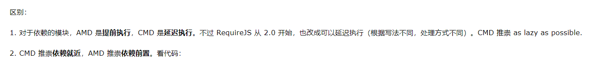


## 复习promise


Object.hasOwnProperty可以判断对象是否有某个属性，不会查找原型链

通过Object.create(null)，创建的对象，是没有原型对象的，所以每个js对象一定对应一个原型对象这句话是不成立的。


## 获取select文本值

```HTML
    <select name="" id="select">
      <option value="1">11</option>
      <option value="2">22</option>
      <option value="3">33</option>
      <option value="4">44</option>
    </select>

    <script>
      document.getElementById("select").onchange = function () {
        console.log(this.options[this.selectedIndex].text);
      };
    </script>
```


## 立即执行函数的this指向全局

## 正则表达式断言


## 作用域链


## html5拖动事件

### 事件的触发顺序

当用户单击左键 的时候

mousedown → mouseup →click


和点击事件有关的都有button属性，通过button属性我们可以知道是哪个按键触发的

通过event.button获取

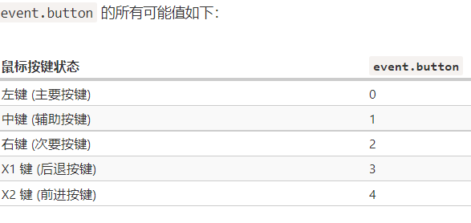

event.which的作用和event.button的作用是一样的


event对象里面有许许多多的属性，例如一些组合键，我们可以通过查看event的相应属性来知道某个按键是否被按下

例如

shiftKey

altKey

ctrlKey

metaKey


### 鼠标点击坐标

clientX  clientY  相对于窗口的坐标

pageX  pageY   相对于文档的坐标


我们的事件一般都会有默认的动作，例如我们点击文本的时候会选择文本，或者按着鼠标在拖拽的时候会选择文本，这些事件我们都可以修改他们，也就是之前的阻止默认事件


通过add注册事件的方法我们可以使用,event.preventdefault()

on监听的方法我们还可以使用return flase


### 防止复制

防止复制的方法之前的也可以使用

这里在介绍以下另外一种方法

使用oncopy 监听

同样是return flase


## 移动鼠标事件

mouseover/mouseout   mouseenter/mouseleave

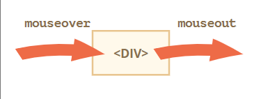

relatedTarget  →  target  →   relatedTarget

related的意思是有关联的

relatedTarget的值可以是null,比如我们要将鼠标移除到浏览器外，这种情况就成立了


mousemove事件

鼠标移动事件，当我们很快的移动鼠标的时候，一部分移动的事件会被忽略，这是为性能考虑的


如果触发了mouseover，那么一定会有mouseout，这叫有始有终


### mouseover/mouseout可以冒泡

mouseenter/mouseleave不可以冒泡

根据浏览器的逻辑，鼠标的指针只能位于单个元素上，也就是嵌套最深的元素（z-index）最大的那个

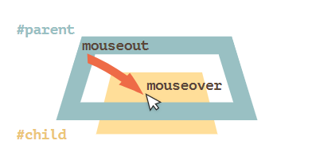


并且还会冒泡

所以可以在父元素添加监听事件


### 拖放事件

[HTML5 拖放 | 菜鸟教程 (runoob.com)](https://www.runoob.com/html/html5-draganddrop.html)

这个傻逼软件不太稳定，使用飞行模式的话效果还可以


### 首先设置元素为可以拖放

```HTML
draggable = 'true'
```


